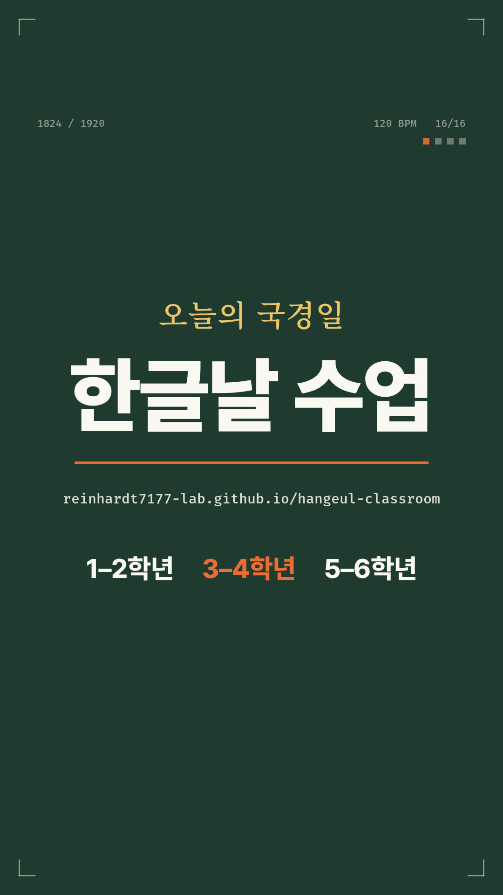

# 한글날 수업 앱 릴스 (9:16)



- **영상:** [out/hangeul-reel.mp4](out/hangeul-reel.mp4)
- **사양:** 32초 · 1080×1920 · 60fps · H.264 · AAC 256k · 6.9MB
- **음량:** −13.9 LUFS, 최고값(true peak) −1.9 dBFS
- **게시 주소:** 배포하면 `videos/hangeul-reel-9x16.mp4`로도 올라간다. 수업 앱과 같은 GitHub Pages 주소다.

[kinetic-type-reel](https://github.com/reinhardt7177-lab/kinetic-type-reel) 스킬의 절차를 그대로 따랐다. 글자·선·색면만 쓰는 키네틱 타이포그래피이고, 모든 움직임과 소리가 120 BPM 박자 그리드(`src/timeline.js`) 하나에 맞춰져 있다. 기획과 사실 근거는 [PLAN.md](PLAN.md)에 있다.

## 16마디

| 마디 | 장면 |
|---|---|
| 1–2 | `> 10월 9일, / 한글날 수업, / 무엇으로 할까?` 32분음표로 타자 → 자모가 흩어져 내림 → 드롭 앞 검은 무음 16분 |
| 3–4 | 모아쓰기: ㅎ·ㅏ·ㄴ이 16분음표마다 박혀 한 박에 「한」으로 합쳐진다 → 「한글날」 → 「한」의 ㅎ 동그라미 속으로 줌 |
| 5 | 1443 계기판이 43→46으로 굴러 1446 (창제 → 해례본 간행) |
| 6 | 훈민정음 28자(명조) → 옛 자모 ㆁ·ㆆ·ㅿ·ㆍ가 떨어지고 24자로 다시 줄을 선다 |
| 7–11 | 학년별 발표 32·35·37장 막대, ‘다음’ 단추, 태블릿 QR, 골든벨(「탈락」에 줄을 긋고 떨어뜨림), 인터넷이 끊겨도(글자가 빠짐) |
| 12–13 | 「40분」이 9배에서 빠져나옴 → 스터터 → 박마다 한 말: 사람마다 / 쉽게 익혀 / 날마다 / 편하게. |
| 14–16 | 이 영상의 소스 코드가 흐르는 바탕 → 「한글날 수업」 잠금 → 첫 프레임의 커서로 빨려 들어감. 끝과 처음이 이어져 반복 재생된다 |

## 만든 방법

| 부분 | 도구 |
|---|---|
| 그림 | Chromium 캔버스(Skia)가 한 프레임을 6~16번 그려 겹친다. 모션 블러는 180° 셔터 |
| 글꼴 | Pretendard Variable(굵기 애니메이션), Noto Serif KR VF(옛 자모), Fira Mono |
| 소리 | Web Audio 합성. 화음은 마디마다 하나이고, 화면 사건마다 소리가 하나씩 붙는다. 킥 사이드체인은 화면의 숨쉬기와 같은 곡선이다 |
| 인코딩 | ffmpeg: libx264 CRF16 slow, bt709, loudnorm 두 번 재기(−14 LUFS / −2 dBTP) |
| 검수 | `review` 모드가 컷 앞뒤 프레임 시트(`out/cuts.png`)를 만들고 음량을 잰다. 드롭 앞 무음 두 곳(3.875–4초, 23.875–24초)이 완전한 무음인지 잰다 |

skia-python 스킬과는 두 가지가 다르다.
- 이 환경에서는 skia-python을 설치할 수 없었다. 그래서 같은 Skia 엔진을 쓰는 브라우저 캔버스로 `engine.py`/`moves.py`를 옮겼다(`src/engine.js`, `src/moves.js`). 함수 이름과 시간감은 같다.
- Surge XT와 샘플 대신 합성음을 썼다.

## 다시 만들기

```bash
sh tools/fetch-fonts.sh                          # 글꼴 (한 번)
node tools/render.cjs sheet s 1 5 9 13           # 검수 시트 out/s.png
node tools/render.cjs audio                      # out/mix.wav + 마디별 음량 · 무음 점검
node tools/render.cjs render --workers 6         # out/hangeul-reel.mp4 (8코어에서 약 8분)
node tools/render.cjs review                     # 컷 시트 + 음량
node tools/render.cjs cover 30.4                 # out/cover.jpg
```

필요한 것은 다음과 같다.
- Node 18+
- `playwright-core`
- 크롬 또는 크로미움
- ffmpeg (libx264·aac 포함)

위치는 `CHROME`, `FFMPEG`, `PLAYWRIGHT` 환경 변수로 바꾼다.

## 블렌더 (선택)

`blender/title3d.py`는 3–4마디의 「한글날」을 두께 있는 3D 글자로 다시 만든다. 박자는 `node tools/render.cjs timeline`이 쓰는 `blender/timeline.json`에서 읽는다. 투명 PNG 열로 렌더한다.

```bash
blender -b -P blender/title3d.py -- --render
```

**블렌더가 없는 환경에서 작성했다. 문법만 검사했고 실제로 돌려 보지 않았다.**

## 확인해 주세요

- 소리는 파형·음량·무음 구간 수치로만 확인했고, 귀로 들어 보지 못했다. 한 번 들어 보고 균형이 이상하면 알려 달라.
- 9마디의 QR 무늬는 장식이다. 스캔되지 않는다.
